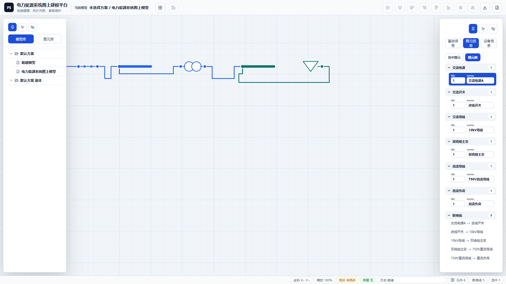
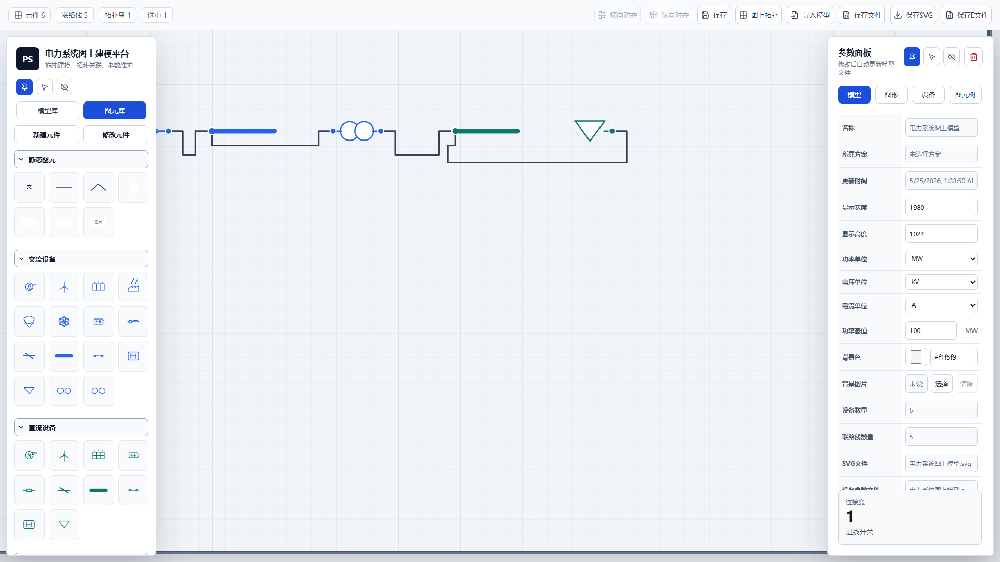
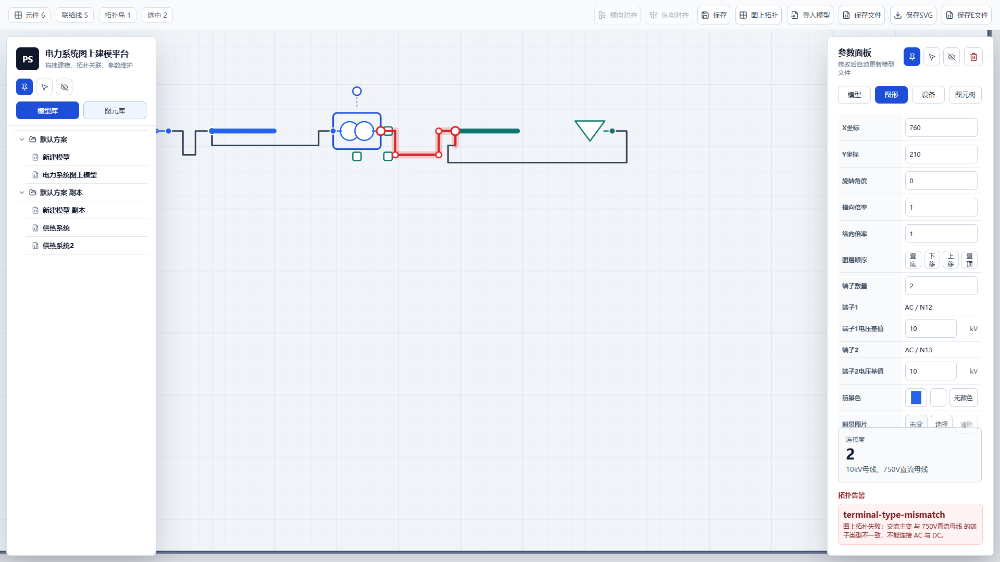
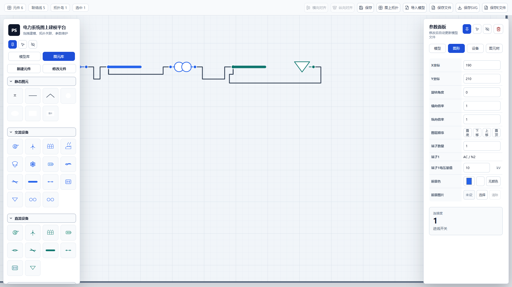
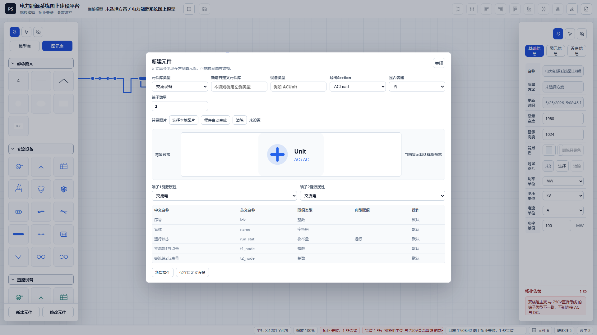
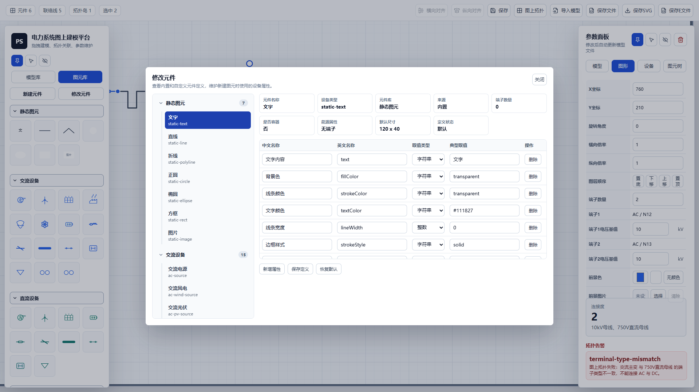
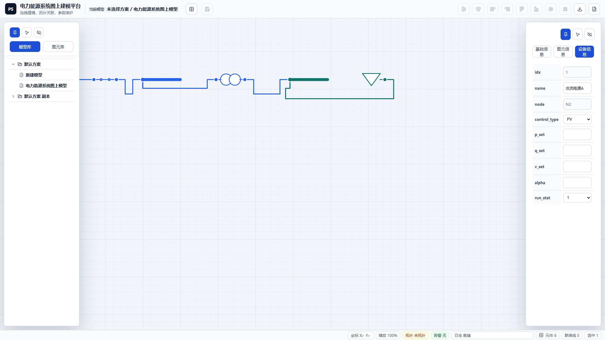
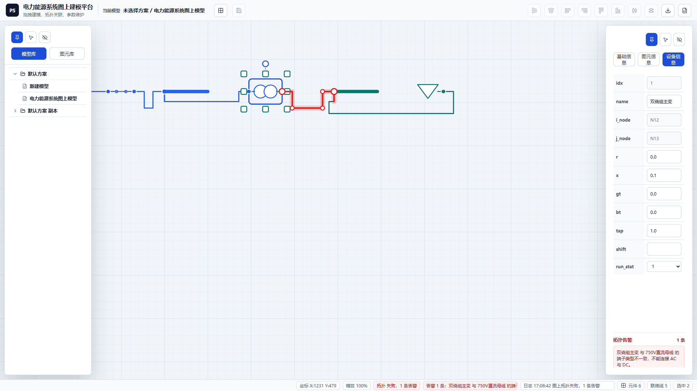
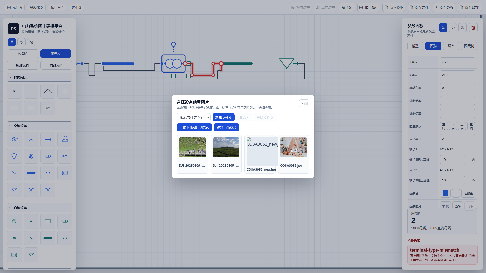
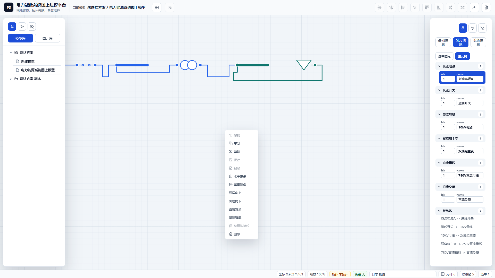

# 电力能源系统图上建模平台用户使用说明

截图标准: 本说明书引用的界面截图均为 1920 x 1080 PNG 文件。

## 目录

01. 适用范围与读者
02. 运行环境与启动
03. 界面布局总览
04. 1080P截图说明
05. 左侧栏显示模式
06. 右侧栏显示模式
07. 顶部工具条
08. 画布坐标与边界
09. 模型库两级结构
10. 新建方案
11. 新建模型
12. 方案与模型重命名
13. 方案与模型复制
14. 删除方案与模型
15. 模型跨方案移动
16. 后台保存机制
17. 图元库总览
18. 静态图元
19. 交流设备库
20. 直流设备库
21. 变流设备库
22. 氢能设备库
23. 热能设备库
24. 新建元件入口
25. 新建元件基础信息
26. 自定义端子
27. 容器元件定义
28. 修改元件窗口
29. 元件属性定义表
30. 拖拽式建模
31. 单击选择与框选
32. 多选与对齐
33. 复制与粘贴图元
34. 删除图元
35. 拖拽移动图元
36. 设备旋转
37. 设备缩放
38. 水平与垂直镜像
39. 图层顺序
40. 画布缩放和平移
41. 单端设备端子移动
42. 连接线绘制
43. Shift/Ctrl 正交锁定
44. 端子类型匹配
45. 母线连接规则
46. 连接线端子重接
47. 连接线选择
48. 手工增加拐点
49. 平移连接线线段
50. 整理连接线
51. 自动避让原则
52. 连接线遮挡排查
53. 模型参数
54. 图形参数
55. 设备参数
56. 容器设备参数
57. 开关与断路器状态
58. 电压基值维护
59. idx 永久序号规则
60. 图上拓扑含义
61. 拓扑错误提示
62. 错误定位
63. 三绕组主变处理
64. ACNode 与 DCNode 导出
65. 保存当前模型
66. 保存 SVG 文件
67. 保存 E 文件
68. 保存 JSON 文件
69. 图片库
70. 图片文件夹管理
71. 设置设备图片
72. 设置模型背景
73. 快捷键
74. 画布右键菜单
75. 图元树
76. 导入模型
77. 后台接口
78. 数据文件夹
79. 交流建模示例
80. 直流建模示例
81. 交直流混合示例
82. 氢能耦合示例
83. 热能耦合示例
84. 建模质量检查
85. 常见问题
86. 故障排查
87. 最佳实践
88. 附录A: 元件库清单
89. 附录B: E 文件分组
90. 附录C: 参数字段说明
91. 附录D: 截图清单
92. 维护建议

\n---\n
## 01. 适用范围与读者

本说明书面向系统建模人员、仿真数据维护人员、运行分析人员以及平台二次开发人员，重点说明如何从 Web 页面完成图上建模、拓扑校核、参数维护与文件输出。

### 操作步骤
1. 确认已经通过浏览器进入平台首页。
2. 确认左右侧栏、顶部工具条、画布和参数面板均可见。
3. 先阅读快速流程，再按专题章节查找具体操作。

### 要点与检查
- 本文描述当前平台功能，不替代电力能源系统专业校核。
- 涉及 E 文件字段时，以设备参数表中显示的英文列名为准。

\n---\n
## 02. 运行环境与启动

平台采用前端 Vite 应用加本地后端服务的方式运行，前端负责画布交互，后端负责图片库和方案/模型落盘。

### 操作步骤
1. 在项目目录执行 npm run dev。
2. 浏览器访问 http://127.0.0.1:5173/。
3. 确认后端接口 http://127.0.0.1:5174/ 可用。

### 要点与检查
- 如果图片库或后台保存失败，优先检查 5174 端口。
- 页面加载后会从本地或后台恢复方案/模型数据。

\n---\n
## 03. 界面布局总览

平台由顶部工具条、左侧资源栏、中间画布和右侧参数栏组成。中间画布是主要建模区域，左右侧栏可固定、隐藏或自动浮动。

### 操作步骤
1. 观察顶部统计信息，确认元件、联络线、拓扑岛和选中数量。
2. 使用左侧栏切换模型库和图元库。
3. 使用右侧栏切换模型、图形、设备、图元树。

### 要点与检查
- 画布显示边界以加粗边框提示。
- 左右侧栏浮动时不会覆盖顶部工具条。

\n---\n
## 04. 1080P截图说明

本说明书中的截图以 1920 x 1080 像素采集，用于保证界面细节、图标和表格文字清晰。

### 操作步骤
1. 截图前将浏览器视口调整到 1920 x 1080。
2. 截图后校验图片尺寸。
3. 插入文档时保持 16:9 比例，不做非等比例拉伸。

### 要点与检查
- 若后续补充截图，应沿用同一分辨率。
- 截图是操作说明的辅助，实际页面可能因数据不同略有差异。

\n---\n
## 05. 左侧栏显示模式

左侧栏用于模型库和图元库，可永久显示、永久隐藏或鼠标靠近时自动显示。

### 操作步骤
1. 点击左侧栏顶部的固定按钮，使侧栏常驻。
2. 点击自动按钮，使鼠标靠近左侧时显示、移出后隐藏。
3. 点击隐藏按钮，释放更多画布空间。

### 要点与检查
- 内容过多时左侧栏自动出现竖向滚动条。
- 自动模式适合大画布建模，固定模式适合频繁拖拽元件。

\n---\n
## 06. 右侧栏显示模式

右侧栏用于查询和修改模型、图形、设备以及图元树信息，支持和左侧栏相同的浮动控制。

### 操作步骤
1. 选择图元或点击画布，右侧栏会自动显示。
2. 通过固定按钮让参数面板常驻。
3. 通过隐藏按钮临时扩大画布视野。

### 要点与检查
- 右侧栏顶部标签始终固定，不随参数表滚动。
- 参数较多时表格区域内部滚动。

\n---\n
## 07. 顶部工具条

顶部工具条集中提供对齐、保存、拓扑、导入、导出 SVG、导出 E 文件等常用命令。

### 操作步骤
1. 选中多个设备后点击横向对齐或纵向对齐。
2. 点击保存写入当前模型。
3. 点击图上拓扑执行拓扑校核与节点编号。

### 要点与检查
- 保存 SVG 和保存 E 文件会弹出保存位置选择。
- Ctrl+S 与保存按钮行为一致。

\n---\n
## 08. 画布坐标与边界

画布是模型图形的显示区域，默认尺寸为 1980 x 1024，可在模型参数表中修改。

### 操作步骤
1. 打开右侧模型标签。
2. 修改显示宽度和显示高度。
3. 观察画布边界加粗提示。

### 要点与检查
- 设备移动和自动布线不应超过显示边界。
- 默认背景色为浅灰色，可在模型参数中修改。

\n---\n
## 09. 模型库两级结构

模型库采用方案/模型两级结构。一个方案对应一个文件夹，一个方案可包含多个模型，一个模型只能属于一个方案。

### 操作步骤
1. 点击方案名称展开或折叠模型列表。
2. 单击模型名称仅选中记录。
3. 双击模型名称加载到画布并高亮当前显示模型。

### 要点与检查
- 方案名称不显示选中样式，模型显示选中样式。
- 当前显示模型用更醒目的颜色区分。

\n---\n
## 10. 新建方案

新建方案时需要输入名称，平台会检查空名称和重名。

### 操作步骤
1. 在模型库空白处或方案处打开右键菜单。
2. 选择新增方案。
3. 在弹窗中输入方案名称并确认。

### 要点与检查
- 方案不能同名。
- 新增成功后会写入后台方案数据。

\n---\n
## 11. 新建模型

新建模型必须归属于某个方案，并在创建时输入模型名称。

### 操作步骤
1. 右键目标方案。
2. 选择新增模型。
3. 输入模型名称。

### 要点与检查
- 同一方案下模型不能同名。
- 模型创建后可双击加载到画布。

\n---\n
## 12. 方案与模型重命名

重命名通过右键菜单触发，平台会进行空值和重复名称检查。

### 操作步骤
1. 在模型库中右键方案或模型。
2. 选择重命名。
3. 输入新名称并确认。

### 要点与检查
- 重复名称会弹出警告且不保存。
- 模型重命名后导出 SVG/E 文件默认名称随之变化。

\n---\n
## 13. 方案与模型复制

单条方案或模型复制会弹窗输入新名称；批量复制和粘贴使用自动唯一名称，避免弹窗过多。

### 操作步骤
1. 选中一条方案或模型后右键复制。
2. 输入副本名称并确认。
3. 批量选中后复制会自动生成唯一名称。

### 要点与检查
- 按 Shift 或 Ctrl 可多选方案或多选模型。
- 方案和模型的多选状态二选一，不混合多选。

\n---\n
## 14. 删除方案与模型

删除操作只在鼠标位于模型列表框内时响应键盘删除，避免与画布删除冲突。

### 操作步骤
1. 将鼠标移入模型库列表。
2. 选中方案或模型。
3. 按 Delete 或右键选择删除。

### 要点与检查
- 不能删除当前被选中的模型及其所在方案。
- 删除前应确认数据已经保存或导出。

\n---\n
## 15. 模型跨方案移动

模型可从当前方案拖拽移动到其他方案，实现方案归档或模型重组。

### 操作步骤
1. 在模型库中按住模型记录。
2. 拖拽到目标方案。
3. 释放鼠标完成归属调整。

### 要点与检查
- 模型只能属于一个方案。
- 移动后后台保存会更新方案文件夹结构。

\n---\n
## 16. 后台保存机制

平台会将方案、模型、SVG 和 E 参数信息保存到后台，便于其他电脑或后台计算程序读取。

### 操作步骤
1. 点击保存按钮。
2. 确认模型更新。
3. 在需要时使用保存文件、保存 SVG 或保存 E 文件导出。

### 要点与检查
- 后台数据位于 data/schemes。
- 图片库位于 data/images。

\n---\n
## 17. 图元库总览

图元库按静态图元、交流设备、直流设备、变流设备、氢能设备、热能设备分组显示，各组可同时展开。

### 操作步骤
1. 切换左侧栏到图元库。
2. 展开需要的元件组。
3. 从图标拖拽元件到画布。

### 要点与检查
- 图元库图标并排显示，不显示长名称，鼠标悬停可辨识。
- 交流设备、直流设备、变流设备等分组纵向排列。

\n---\n
## 18. 静态图元

静态图元不参与拓扑，适合做标题、说明、区域边框、图片背景和流程标注。

### 操作步骤
1. 拖入文字、直线、折线、正圆、椭圆、方框或图片。
2. 在右侧图形参数中修改颜色、线宽和文字样式。
3. 使用图层操作调整遮挡关系。

### 要点与检查
- 静态图元默认不画边框。
- 文本图元支持多行内容。

\n---\n
## 19. 交流设备库

交流设备用于建立交流网络模型，端子能源属性为交流电。

### 操作步骤
1. 从交流设备分组拖入电源、线路、母线、开关、断路器、负荷或主变。
2. 通过端子与其他交流端子或交流母线连接。
3. 在设备参数中维护 E 文件列名对应字段。

### 要点与检查
- 交流母线是一根粗线，不显示普通端子。
- 交流开关和断路器 status 变化会驱动显示样式。

\n---\n
## 20. 直流设备库

直流设备用于建立直流网络模型，端子能源属性为直流电。

### 操作步骤
1. 拖入直流电源、直流储能、直流线路、直流母线、直流开关、直流断路器或直流负荷。
2. 连接时只允许直流端子互连。
3. 按图上拓扑生成直流节点号。

### 要点与检查
- 直流线路中间用电阻符号表达。
- 直流电源和直流负荷都是单端口设备。

\n---\n
## 21. 变流设备库

变流设备用于交流、直流或同类型网络之间的能量转换建模。

### 操作步骤
1. 拖入 DCDC、ACDC 或 ACAC 变流器。
2. 确认两端端子能源属性。
3. 维护 r1、r2、control_type 等设备参数。

### 要点与检查
- ACDC 设备一端为交流、一端为直流。
- 连接错误会在拓扑校核中提示。

\n---\n
## 22. 氢能设备库

氢能设备支持氢源、氢荷、储氢、输氢、压缩、减压、阀门以及电-氢转换设备。

### 操作步骤
1. 拖入氢源、储氢罐、氢荷或输氢管道。
2. 对跨能流设备使用容器参数视图。
3. 通过氢能端子或氢能母线建立网络。

### 要点与检查
- 储氢罐类似母线，可接多个连接点。
- 氢能端子颜色与氢能网络保持一致。

\n---\n
## 23. 热能设备库

热能设备支持热源、热荷、储热、输热、循环水泵、阀门、热交换器以及电-热转换设备。

### 操作步骤
1. 拖入热力母线、储热罐、热源、热荷或输热管道。
2. 按单端、双端、三端或四端热交换器选择合适图元。
3. 维护热力侧参数并保持端口含义一致。

### 要点与检查
- 储热罐类似母线处理。
- 双端热源和双端热荷占用相邻两个热端子。

\n---\n
## 24. 新建元件入口

用户可通过新建元件扩展元件库，适合新增设备类型或企业内部图标。

### 操作步骤
1. 切换到图元库。
2. 点击新建元件。
3. 输入元件库类型、设备类型、端子数量和属性定义。

### 要点与检查
- 元件库名称不能与已有名称重复。
- 设备类型不能与已有类型重复。

\n---\n
## 25. 新建元件基础信息

新建元件需要先确定所属元件库、设备类型、是否容器、端子数量和背景图。

### 操作步骤
1. 选择已有元件库或输入新元件库名称。
2. 填写设备类型，例如 ACUnit。
3. 选择是否容器。

### 要点与检查
- 端子数量最多 4 个。
- 背景图片支持本地选择和程序自动生成，并提供预览。

\n---\n
## 26. 自定义端子

自定义元件的每个端子都要指定能源属性，能源属性决定可连接对象。

### 操作步骤
1. 按端子逐项选择交流电、直流电、氢能或热能。
2. 如果是容器，再选择端子关联设备。
3. 保存后从图元库拖拽使用。

### 要点与检查
- 普通端子按同类型连接。
- 容器端子还会产生关联设备 idx 字段。

\n---\n
## 27. 容器元件定义

容器元件本体不直接参与拓扑，而是通过端子关联到源、荷或双端设备。

### 操作步骤
1. 启用是否容器。
2. 为每个端子选择源/荷关联对象。
3. 检查自动生成的 idx_* 关联字段。

### 要点与检查
- 双端关联会占用端子 t 和 t+1，t+1 的关联属性为空且不可编辑。
- 三绕组主变也是容器。

\n---\n
## 28. 修改元件窗口

修改元件窗口用于查看内置和自定义元件定义，并维护设备属性表。

### 操作步骤
1. 点击图元库中的修改元件。
2. 在左侧二级列表中展开元件库和元件。
3. 修改属性行后保存定义。

### 要点与检查
- 只读默认字段不能删除。
- 容器元件会展示端子关联信息。

\n---\n
## 29. 元件属性定义表

属性定义表包含中文名称、英文名称、取值类型和典型取值。设备参数表使用英文名作为第一列。

### 操作步骤
1. 新增属性行。
2. 填写英文名称。
3. 选择整数、浮点数、字符串或枚举量。

### 要点与检查
- idx、name、run_stat 和节点号字段为默认属性。
- pbase、qbase、r、x、b、gt、bt 等按浮点数维护。

\n---\n
## 30. 拖拽式建模

建模从左侧图元库拖拽元件到画布开始，释放鼠标后生成图元并分配永久 idx。

### 操作步骤
1. 选择目标元件图标。
2. 拖到画布合适位置。
3. 释放鼠标生成设备。

### 要点与检查
- 新设备 idx 在同类型最大 idx 基础上递增。
- 如果已有设备删除，空出的 idx 不再复用。

\n---\n
## 31. 单击选择与框选

画布支持单击选择单个图元，也支持鼠标框选多个设备、静态图元和连接线。

### 操作步骤
1. 在空白画布按下鼠标左键并拖动。
2. 松开后框内图元会被选中。
3. 查看顶部选中数量和右侧参数面板。

### 要点与检查
- 按 Ctrl 时画布进入缩放/平移优先逻辑。
- 不按 Ctrl 时提供框选和拖拽选择能力。

\n---\n
## 32. 多选与对齐

选中多个设备后可进行横向对齐或纵向对齐。

### 操作步骤
1. 框选或按修饰键选择多个设备。
2. 点击顶部横向对齐或纵向对齐。
3. 检查连接线是否随设备移动自动更新。

### 要点与检查
- 对齐只作用于设备，不会把连接线当作对齐对象。
- 对齐前建议保存或确认撤销栈可用。

\n---\n
## 33. 复制与粘贴图元

画布复制/粘贴支持设备、静态图元和连接线。粘贴位置跟随鼠标，所选图元区域左上角落到鼠标位置。

### 操作步骤
1. 选中图元后按 Ctrl+C 或右键复制。
2. 将鼠标移动到目标画布位置。
3. 按 Ctrl+V 或右键粘贴。

### 要点与检查
- 超出显示边界会提示越界。
- 复制的设备会重新分配 idx。

\n---\n
## 34. 删除图元

画布内按 Delete 删除被选中图元，包括设备、静态图元和连接线。

### 操作步骤
1. 确认鼠标在画布内。
2. 选中一个或多个图元。
3. 按 Delete 或右键删除。

### 要点与检查
- 如果没有选中图元，会提示当前没有被选中图元。
- 删除设备会同步清除相关连接线。

\n---\n
## 35. 拖拽移动图元

拖拽一个被选中设备时，所有被选中的设备一起平移。

### 操作步骤
1. 选中多个设备。
2. 按住其中一个设备拖动。
3. 松开后检查整体位置。

### 要点与检查
- 母线移动时母线上的连接点跟随移动。
- 连接线中间手工拐点会按相关端点位移跟随。

\n---\n
## 36. 设备旋转

点击设备后可以通过旋转手柄按 90 度为单位做 360 度旋转。

### 操作步骤
1. 选中单个设备。
2. 拖动旋转手柄。
3. 在右侧图形参数中查看旋转角度。

### 要点与检查
- 旋转不改变设备参数。
- 端子和连接线会按旋转后的图形位置更新。

\n---\n
## 37. 设备缩放

设备支持横向、纵向和整体等比例缩放，当前版本已去掉最高和最低比例限制。

### 操作步骤
1. 选中单个设备。
2. 拖动横向、纵向或整体缩放手柄。
3. 也可在图形参数中输入 scaleX 或 scaleY。

### 要点与检查
- 端子大小、选中边框线宽和控制点大小不会随设备缩放。
- 缩放后设备仍受显示边界约束。

\n---\n
## 38. 水平与垂直镜像

设备和静态图元可通过右键菜单做水平镜像或垂直镜像。

### 操作步骤
1. 选中目标图元。
2. 右键打开画布菜单。
3. 选择水平镜像或垂直镜像。

### 要点与检查
- 镜像会改变图形方向，不修改电气参数。
- 镜像后应检查端子所在侧和连接线端部方向。

\n---\n
## 39. 图层顺序

图层顺序决定图元之间的遮挡关系，可通过右键菜单或图形参数中的按钮调整。

### 操作步骤
1. 选中图元。
2. 右键选择图层向上、图层向下、图层置顶或图层置底。
3. 观察遮挡关系。

### 要点与检查
- 选中的连接线和端子手柄会置于最上层。
- 图层操作适合处理静态图元背景和设备遮挡。

\n---\n
## 40. 画布缩放和平移

鼠标位于画布内滚轮滚动时，只缩放画布和画布内图元，不缩放页面侧栏。

### 操作步骤
1. 将鼠标移动到画布。
2. 滚动滚轮缩放。
3. 按住 Ctrl 并拖动画布进行平移。

### 要点与检查
- 缩放围绕鼠标位置进行。
- 不按 Ctrl 时鼠标拖动优先用于框选或移动图元。

\n---\n
## 41. 单端设备端子移动

源、荷等单端元件的端子可以在设备四周调整位置，但释放后会落到最近边的中心位置。

### 操作步骤
1. 鼠标放到端子上。
2. 按下左键并保持不松开，进入端子移动模式。
3. 移动端子后松开鼠标。

### 要点与检查
- 移动端子不会破坏已有连接关系。
- 连接线末端会随端子移动并保持正交连接。

\n---\n
## 42. 连接线绘制

点击悬空端子进入连接线绘制模式，预览线终点跟随鼠标移动，到同类型端子或母线后点击完成连接。

### 操作步骤
1. 点击起点端子。
2. 移动鼠标观察虚化连接线。
3. 点击同类型目标端子或目标母线。

### 要点与检查
- 右键可取消虚化连接线并回到选择模式。
- 只有同类型端子之间可正式连接。

\n---\n
## 43. Shift/Ctrl 正交锁定

连接线绘制模式下按住 Shift 或 Ctrl，鼠标预览点会锁定为相对起点的水平或竖直方向。

### 操作步骤
1. 点击悬空端子进入连接线绘制。
2. 按住 Shift 或 Ctrl 移动鼠标。
3. 观察预览线保持单条水平线或竖直线。

### 要点与检查
- 该功能用于避免手抖产生小折线。
- 未按修饰键时仍按普通正交路径预览。

\n---\n
## 44. 端子类型匹配

端子按交流电、直流电、氢能、热能四类能源属性区分，类型不同不能连接。

### 操作步骤
1. 查看端子颜色和右侧图形参数中的端子类型。
2. 只连接同类端子。
3. 执行图上拓扑验证。

### 要点与检查
- 交流与直流误连会产生拓扑错误。
- 跨能流设备通过容器关联表达，不应直接把不同类型端子短接。

\n---\n
## 45. 母线连接规则

交流母线、直流母线、氢能母线、热力母线以及储氢罐、储热罐采用母线式连接，不限制连接位置。

### 操作步骤
1. 把连接线端子拖到母线上任意位置。
2. 观察母线中心线上的圆点。
3. 移动母线确认圆点和连接线跟随。

### 要点与检查
- 圆点属于连接线端子。
- 圆点中心始终在母线横向中心轴线上。

\n---\n
## 46. 连接线端子重接

选中连接线后可以拖拽首端或末端圆点，把端子从当前设备调整到其他同类型端子或母线。

### 操作步骤
1. 选中连接线。
2. 拖动首端或末端圆点。
3. 移动到目标端子或母线后释放。

### 要点与检查
- 端点拖到其他端子后保留中间手工拐点。
- 如果路径明显无效，系统会做正交化兜底修复。

\n---\n
## 47. 连接线选择

连接线设置了较宽的命中区域，点击线附近即可模糊选中。

### 操作步骤
1. 把鼠标移动到连接线附近。
2. 单击连接线。
3. 确认线和端子手柄位于最上层。

### 要点与检查
- 选中连接线后右侧显示联络线信息。
- 多个连接线端子重合时优先命中当前选中连接线控制点。

\n---\n
## 48. 手工增加拐点

连接线支持人工局部微调，双击线段可增加直角拐点。

### 操作步骤
1. 选中连接线。
2. 双击某一水平或垂直线段。
3. 在新增位置拖动线段或拐点。

### 要点与检查
- 路径仍保持横平竖直。
- 不要把手工拐点拖到设备内部。

\n---\n
## 49. 平移连接线线段

除首端线段和末端线段外，中间水平线段可上下移动，垂直线段可左右移动。

### 操作步骤
1. 选中连接线。
2. 拖动水平线段上下移动。
3. 拖动垂直线段左右移动。

### 要点与检查
- 移动时只改变相邻拐点坐标。
- 若平移会造成遮挡或重叠，系统可能拒绝该路径。

\n---\n
## 50. 整理连接线

整理连接线用于自动减少不必要小折线，同时保留端点垂直和避让约束。

### 操作步骤
1. 选中连接线。
2. 右键选择整理连接线。
3. 检查线段数量是否减少。

### 要点与检查
- 系统会优先保留首末端正交连接。
- 如用户需要复杂路径，可继续手工调整。

\n---\n
## 51. 自动避让原则

联络线始终遵循不穿越设备、不与其他图元干涉、首末端与端子法平面垂直、尽量减少拐点的原则。

### 操作步骤
1. 移动设备后观察相关连接线是否自动重算。
2. 若出现遮挡，选中连接线后整理或手工平移。
3. 保存前进行视觉检查。

### 要点与检查
- 不相关且无干涉的连接线不应被动变化。
- 自动绕线会在边界内寻找最短安全正交路径。

\n---\n
## 52. 连接线遮挡排查

如果发现连接线穿越设备或被图元覆盖，应先判断是布线路径问题还是图层遮挡问题。

### 操作步骤
1. 选中该连接线。
2. 使用整理连接线。
3. 若是图层问题，将设备或静态图元下移或置底。

### 要点与检查
- 连接线被选中时会置顶。
- 设备拖拽过程中应同步更新相关连接线。

\n---\n
## 53. 模型参数

模型标签显示模型名称、方案名称、更新时间、画布尺寸、单位、功率基值、背景色、背景图片以及文件名。

### 操作步骤
1. 点击画布空白处或切换右侧模型标签。
2. 修改画布宽度、高度和单位。
3. 设置模型背景色或背景图片。

### 要点与检查
- 模型信息表第一列使用中文。
- 功率基值显示为数值加功率单位。

\n---\n
## 54. 图形参数

图形标签维护选中图元的显示属性，包括坐标、旋转、缩放、图层、端子数量、端子电压基值、前景色和前景图片。

### 操作步骤
1. 选中设备或静态图元。
2. 切换右侧图形标签。
3. 修改显示属性并观察画布变化。

### 要点与检查
- 图形信息表第一列使用中文。
- 端子数量和端子电压基值属于图形参数。

\n---\n
## 55. 设备参数

设备标签维护与 E 文件列名一致的设备参数，第一列默认使用英文名，鼠标悬停查看中文含义。

### 操作步骤
1. 选中设备。
2. 切换右侧设备标签。
3. 按英文列名维护参数。

### 要点与检查
- node、i_node、j_node 等拓扑节点号为只读。
- name、run_stat、status 等参数会影响导出或显示。

\n---\n
## 56. 容器设备参数

容器设备参数采用 1+N 标签结构：容器本体和端子关联设备分开展示。

### 操作步骤
1. 选中电制氢、电制热、燃料电池、供热锅炉或三绕组主变。
2. 在设备参数中切换容器本体和关联设备标签。
3. 查看关联 idx 和端子信息。

### 要点与检查
- 容器本体不直接参与拓扑。
- 关联设备按端子能源属性生成。

\n---\n
## 57. 开关与断路器状态

交流/直流开关和断路器的 status 字段对应设备开合状态。

### 操作步骤
1. 选中开关或断路器。
2. 在设备参数中修改 status。
3. 观察图上开合样式变化。

### 要点与检查
- 0 表示打开，1 表示闭合。
- 导出 E 文件时 status 会归一化。

\n---\n
## 58. 电压基值维护

每个交流或直流端子可在图形参数中维护电压基值。

### 操作步骤
1. 选中设备。
2. 在图形标签中找到端子电压基值。
3. 只输入数值，单位随模型电压单位显示。

### 要点与检查
- 拓扑校核会检查同一拓扑节点电压基值是否一致。
- 母线和端子连接到一起时应使用相同电压等级。

\n---\n
## 59. idx 永久序号规则

idx 是设备在同类型设备中的唯一序号，从 1 开始，新增时自动生成并永久保持。

### 操作步骤
1. 拖入新设备。
2. 查看设备参数 idx。
3. 删除设备后再新增同类型设备。

### 要点与检查
- 新设备 idx 在历史最大值基础上递增。
- 删除造成的空号不会被复用。

\n---\n
## 60. 图上拓扑含义

图上拓扑会收缩所有连接线，把两两相连端子或连接到同一母线的端子归并为同一节点号。

### 操作步骤
1. 完成连线后点击图上拓扑。
2. 查看成功或失败提示。
3. 成功后检查端子 nodeNumber。

### 要点与检查
- 交流、直流、氢能、热能分别编号。
- 交流和直流节点从 1 开始递增。

\n---\n
## 61. 拓扑错误提示

拓扑失败时平台会列出错误信息，例如端子悬空、端子类型不一致、电压基值不一致。

### 操作步骤
1. 点击图上拓扑。
2. 查看右侧拓扑告警区域。
3. 逐条处理错误。

### 要点与检查
- 错误信息可双击定位。
- 拓扑失败时不应导出用于计算的最终 E 文件。

\n---\n
## 62. 错误定位

双击拓扑错误信息后，相关设备会被选中并自动移动到屏幕中央。

### 操作步骤
1. 在右侧拓扑告警中找到错误。
2. 双击错误条目。
3. 查看画布居中定位后的设备。

### 要点与检查
- 定位的是可能有问题的设备或连接线相关设备。
- 消缺后重新执行图上拓扑。

\n---\n
## 63. 三绕组主变处理

三绕组主变是容器，三个端子分别关联三个双绕组主变的首端，末端连接到自动生成的中性点。

### 操作步骤
1. 拖入三绕组主变。
2. 维护三侧参数。
3. 执行图上拓扑并导出 E 文件。

### 要点与检查
- 中性点在拓扑时自动生成。
- 中性点电压等级取 1.0。

\n---\n
## 64. ACNode 与 DCNode 导出

ACNode 和 DCNode 不由用户手工新增，而是根据图上拓扑结果生成。

### 操作步骤
1. 完成图上拓扑。
2. 点击保存 E 文件。
3. 在 E 文件中检查 ACNode/DCNode 分组。

### 要点与检查
- 节点号来自拓扑归并结果。
- 节点电压基值取同一拓扑节点内代表设备或端子。

\n---\n
## 65. 保存当前模型

保存会将当前模型写入方案/模型数据，并同步到后台。

### 操作步骤
1. 点击顶部保存按钮或按 Ctrl+S。
2. 观察模型更新时间。
3. 必要时刷新页面确认仍可加载。

### 要点与检查
- 保存按钮不弹出目录选择。
- 导出按钮用于生成独立文件。

\n---\n
## 66. 保存 SVG 文件

保存 SVG 会弹出保存位置选择窗口，默认文件名为模型名称.svg。

### 操作步骤
1. 点击保存SVG。
2. 选择导出目录。
3. 按需修改文件名。

### 要点与检查
- SVG 包含画布、连接线、设备图元、图片和端子显示信息。
- 导出目录会由浏览器记忆。

\n---\n
## 67. 保存 E 文件

保存 E 文件会以能源系统模型格式输出设备参数和拓扑节点。

### 操作步骤
1. 先执行图上拓扑并处理错误。
2. 点击保存E文件。
3. 选择导出目录，默认文件名为模型名称.e。

### 要点与检查
- E 文件按 PowerBase 和设备分组输出。
- 拓扑节点号会用拓扑结果替换。

\n---\n
## 68. 保存 JSON 文件

保存文件用于导出完整模型 JSON，适合备份、迁移或问题复现。

### 操作步骤
1. 点击保存文件。
2. 保存 JSON 文件。
3. 在其他环境中使用导入模型恢复。

### 要点与检查
- JSON 包含图形、参数、连接线和画布设置。
- 不要把 JSON 与 E 文件混用。

\n---\n
## 69. 图片库

设备图片和模型背景图片通过后台图片库管理，本地图片先上传到后台，再从列表中选择应用。

### 操作步骤
1. 双击设备或点击图形参数中的选择。
2. 在图片弹窗中选择文件夹。
3. 上传本地图片，再从后台列表选择。

### 要点与检查
- 图片弹窗支持取消当前图片。
- 图片保存到后台后可被其他网页加载。

\n---\n
## 70. 图片文件夹管理

后台图片库支持多文件夹管理，便于按项目、专业或图标类型归档。

### 操作步骤
1. 在图片弹窗中选择新建文件夹。
2. 上传图片到当前文件夹。
3. 可重命名或删除非默认文件夹。

### 要点与检查
- 删除文件夹后图片会回到默认文件夹或按后台规则归档。
- 文件夹名称不能重复。

\n---\n
## 71. 设置设备图片

设备可设置背景图片或前景图片。背景图片铺满设备显示空间，前景图片覆盖原显示内容。

### 操作步骤
1. 双击设备打开图片选择窗口。
2. 上传或选择后台图片。
3. 保存模型后刷新确认图片仍显示。

### 要点与检查
- 图片会随设备缩放自动调整。
- 也可在右侧图形参数中设置前景色和前景图片。

\n---\n
## 72. 设置模型背景

整个模型支持背景色和背景图片，用于底图、区域划分或展示模板。

### 操作步骤
1. 点击画布空白处。
2. 切换右侧模型标签。
3. 设置背景色或选择背景图片。

### 要点与检查
- 默认背景色为浅灰色。
- 背景图片只影响显示和 SVG，不改变拓扑。

\n---\n
## 73. 快捷键

快捷键会根据鼠标所在区域决定响应对象：鼠标在画布内由画布响应，鼠标在模型列表内由模型库响应。

### 操作步骤
1. 画布内 Ctrl+A 选择所有设备。
2. 画布内 Ctrl+C/Ctrl+V 复制粘贴图元。
3. 模型库内 Ctrl+C/Ctrl+V 复制粘贴方案或模型。

### 要点与检查
- Delete 在画布内删除选中图元。
- Ctrl+Z 撤销上一次画布操作。

\n---\n
## 74. 画布右键菜单

画布右键菜单提供撤销、复制、保存、粘贴、镜像、图层、整理连接线和删除等操作。

### 操作步骤
1. 在画布或图元上右键。
2. 选择操作。
3. 菜单执行后自动关闭。

### 要点与检查
- 右键菜单无边框，有鼠标进入、退出和点击响应效果。
- 任意位置左键点击会关闭菜单。

\n---\n
## 75. 图元树

图元树是右侧栏的二级树，第一级为元件类型，第二级为该类型下的图元名称。

### 操作步骤
1. 切换右侧图元树标签。
2. 展开或折叠元件类型。
3. 双击图元名称定位并选中画布图元。

### 要点与检查
- 图元树与模型/图形/设备标签并列。
- 树中图元会按当前模型实时更新。

\n---\n
## 76. 导入模型

导入模型用于恢复或加载外部 JSON 模型文件。

### 操作步骤
1. 点击导入模型。
2. 选择模型 JSON 文件。
3. 检查画布、连接线和参数是否恢复。

### 要点与检查
- 导入后建议立即保存到当前方案。
- 外部文件中的图片资产需确保后台可访问。

\n---\n
## 77. 后台接口

后端提供图片和方案模型接口，供前端保存和其他程序读取。

### 操作步骤
1. GET /api/images 查询图片。
2. POST /api/images 上传图片。
3. GET/PUT /api/schemes 读取和保存方案模型。

### 要点与检查
- 接口默认运行在 127.0.0.1:5174。
- 后台写入 data/images 和 data/schemes。

\n---\n
## 78. 数据文件夹

后台保存的数据按图片库和方案模型分开管理。

### 操作步骤
1. 查看 data/images 中的图片和 manifest。
2. 查看 data/schemes 中的方案清单。
3. 查看 data/schemes/files 中生成的 json、svg、e 文件。

### 要点与检查
- 不要手工删除 manifest 中仍被引用的图片。
- 后台计算程序可读取生成的 E 文件。

\n---\n
## 79. 交流建模示例

交流示例通常从交流电源、开关、母线、线路、主变和负荷开始。

### 操作步骤
1. 拖入交流电源和交流母线。
2. 通过交流开关、线路或主变连接。
3. 执行图上拓扑并维护 ACGenerator、ACBranch、ACLoad 参数。

### 要点与检查
- 交流端子只能连接交流端子或交流母线。
- 电压基值不一致会导致拓扑失败。

\n---\n
## 80. 直流建模示例

直流示例通常包含直流电源、直流母线、直流线路、直流开关、直流断路器和直流负荷。

### 操作步骤
1. 拖入直流设备。
2. 连接直流网络。
3. 维护 DCGenerator、DCBranch、DCLoad 参数。

### 要点与检查
- 直流线路只维护电阻 r。
- 直流母线对应 DCRealBs。

\n---\n
## 81. 交直流混合示例

交直流混合模型通过 ACDC 变流器连接交流网络和直流网络。

### 操作步骤
1. 建立交流侧和直流侧网络。
2. 拖入 ACDC 变流器。
3. 分别连接交流端子和直流端子。

### 要点与检查
- 不要直接把交流端子和直流端子短接。
- 导出时 ACDC 设备进入 DCACConverter 分组。

\n---\n
## 82. 氢能耦合示例

电制氢和燃料电池使用容器机制表达电力网络和氢能网络之间的耦合。

### 操作步骤
1. 拖入交流电制氢或直流电制氢。
2. 电端接交流/直流网络，氢端接氢能网络。
3. 查看容器关联的电负荷和氢源。

### 要点与检查
- 电制氢本体不直接参与拓扑。
- 关联设备 idx 由容器参数维护。

\n---\n
## 83. 热能耦合示例

电制热、供热锅炉、储热罐和热力母线用于构建热力网络。

### 操作步骤
1. 拖入热力母线或储热罐。
2. 拖入电制热或供热锅炉容器。
3. 连接热端并维护热力参数。

### 要点与检查
- 双端热源/热荷占用相邻端子。
- 热力端子不能与电端子直接连接。

\n---\n
## 84. 建模质量检查

保存或导出前建议执行统一检查，减少拓扑错误和文件错误。

### 操作步骤
1. 执行图上拓扑。
2. 检查拓扑告警为空。
3. 检查端子电压基值、run_stat、status 和 idx。

### 要点与检查
- 连接线不应遮挡设备或与其他线重叠。
- 所有设备参数应使用 E 文件列名。

\n---\n
## 85. 常见问题

常见问题多与鼠标所在区域、端子类型、图片后台和连接线避让有关。

### 操作步骤
1. 确认鼠标在画布或模型库内再使用快捷键。
2. 确认连接端子能源属性一致。
3. 确认后端服务可用。

### 要点与检查
- 如果线段不能移动，通常是路径会破坏避让约束。
- 如果图片不显示，检查图片是否已经上传到后台。

\n---\n
## 86. 故障排查

出现异常时按从界面到数据再到后台的顺序排查。

### 操作步骤
1. 刷新页面确认是否恢复。
2. 检查浏览器控制台和后台端口。
3. 导出 JSON 作为问题复现文件。

### 要点与检查
- 不要直接修改正在使用的后台文件。
- 修复后重新保存模型。

\n---\n
## 87. 最佳实践

复杂模型应按区域、能流和电压等级分层组织，尽量减少交叉连接。

### 操作步骤
1. 先放母线和主干设备。
2. 再布置源、荷和辅助设备。
3. 最后整理连接线和图层。

### 要点与检查
- 命名要稳定，便于 E 文件和图元树查询。
- 使用模型复制保存阶段性版本。

\n---\n
## 88. 附录A: 元件库清单

当前内置元件库按专业分组维护，静态图元不参与拓扑，能源设备按端子类型参与连接与拓扑。

### 要点与检查
- 下表为当前版本主要内置元件组。

| 元件库 | 主要内容 |
|---|---|
| 静态图元 | 文字、直线、折线、正圆、椭圆、方框、图片。默认不画边框，适合标题、标注、区域框、背景照片等非拓扑对象。 |
| 交流设备 | 交流电源、交流风电、交流光伏、交流火电、交流水电、交流核电、交流储能、交流线路、交流零阻抗支路、交流母线、交流开关、交流断路器、交流负荷、交流主变、三绕组主变。 |
| 直流设备 | 直流电源、直流风电、直流光伏、直流储能、直流线路、直流零阻抗支路、直流母线、直流开关、直流断路器、直流负荷。 |
| 变流设备 | DCDC变流器、ACDC变流器、ACAC变流器。端子按交流/直流属性约束，只允许同类型端子连接。 |
| 氢能设备 | 交流电制氢、直流电制氢、氢源、储氢罐、氢荷、交流燃料电池、直流燃料电池、氢能母线、氢压机、减压阀、截止阀、输氢管道。 |
| 热能设备 | 供热锅炉、供热锅炉2、单端热源、双端热源、双端/三端/四端热交换器、交流/直流电制热、储热罐、热负荷、单端/双端热荷、热力母线、输热管道、循环水泵、截止阀。 |
\n---\n
## 89. 附录B: E 文件分组

E 文件导出按模型参数、拓扑节点和设备分组生成。设备参数表第一列与 E 文件列名保持一致。

### 要点与检查
- 下表列出主要导出分组和字段。

| E分组 | 字段 | 说明 |
|---|---|---|
| PowerBase | `p_base, u_unit, p_unit, i_unit` | 模型功率基值与单位设置。 |
| ACRealBs | `idx, name, node, run_stat` | 交流母线，图上拓扑后生成节点号。 |
| DCRealBs | `idx, name, node, run_stat` | 直流母线，图上拓扑后生成节点号。 |
| ACNode | `idx, name, vbase, voltage, angle, isl, run_stat` | 由交流拓扑节点自动导出。 |
| DCNode | `idx, name, vbase, voltage, isl, run_stat` | 由直流拓扑节点自动导出。 |
| ACBranch | `idx, name, i_node, j_node, r, x, b, run_stat` | 交流线路。 |
| DCBranch | `idx, name, i_node, j_node, r, run_stat` | 直流线路。 |
| ACZeroBranch | `idx, name, i_node, j_node, run_stat` | 交流零阻抗支路。 |
| DCZeroBranch | `idx, name, i_node, j_node, run_stat` | 直流零阻抗支路。 |
| ACLoad | `idx, name, node, pbase, pv0, pv1, pv2, qbase, qv0, qv1, qv2, run_stat` | 交流负荷。 |
| DCLoad | `idx, name, node, pbase, pv0, pv1, pv2, run_stat` | 直流负荷。 |
| ACGenerator | `idx, name, node, control_type, p_set, q_set, v_set, alpha, run_stat` | 交流电源、交流储能等。 |
| DCGenerator | `idx, name, node, control_type, v_set, p_set, i_set, run_stat` | 直流电源、直流储能等。 |
| ACSwitch | `idx, name, i_node, j_node, status, run_stat` | 交流开关。 |
| DCSwitch | `idx, name, i_node, j_node, status, run_stat` | 直流开关。 |
| ACBreak | `idx, name, i_node, j_node, status, run_stat` | 交流断路器导出分组。 |
| DCBreak | `idx, name, i_node, j_node, status, run_stat` | 直流断路器导出分组。 |
| ACTransformer | `idx, name, i_node, j_node, r, x, gt, bt, tap, shift, run_stat` | 双绕组交流变压器；三绕组主变会展开关联双绕组支路。 |
| ThreePowerTransformer | `idx, name, run_stat, idx_xf_t1, idx_xf_t2, idx_xf_t3` | 三绕组主变容器本体。 |
| DCDCConverter | `idx, name, i_node, j_node, r1, r2, control_type, p_set, i_set, v_set, run_stat` | 直流-直流变流器。 |
| DCACConverter | `idx, name, ac_node, dc_node, r1, r2, control_type, p_ac_set, q_ac_set, v_ac_set, v_dc_set, run_stat` | 交直流变流器导出分组。 |
| ACACConverter | `idx, name, i_node, j_node, r1, r2, control_type, p_set, i_q_set, j_q_set, i_v_set, j_v_set, run_stat` | 交流-交流变流器。 |
\n---\n
## 90. 附录C: 参数字段说明

本附录列出常用英文参数名及其含义，便于维护设备参数和核对导出文件。

### 要点与检查
- 鼠标悬停设备参数第一列可查看中文含义。

| 英文名 | 说明 |
|---|---|
| `idx` | 设备在同类型设备中的永久序号，新增时自动生成，删除后不复用。 |
| `name` | 设备名称，可在设备参数表中维护。 |
| `run_stat` | 工作状态，通常 1 表示运行，0 表示停运。 |
| `node / i_node / j_node` | 拓扑节点号，由图上拓扑生成，不能手工直接修改。 |
| `vbase` | 端子或节点电压基值，图形参数中只编辑数字，单位跟随模型电压单位。 |
| `status` | 开关/断路器状态，0 表示打开，1 表示闭合，并驱动图上显示样式。 |
| `r / x / b` | 线路或变压器阻抗参数，按 E 文件列名维护。 |
| `r1 / r2` | 变流器首端、末端等值电阻。 |
| `control_type` | 源、变流器、补偿类设备的控制方式字段。 |
| `pbase / qbase` | 负荷有功、无功基准。 |
\n---\n
## 91. 附录D: 截图清单

本说明书引用的全部界面截图均为 1920 x 1080 PNG 文件。

### 要点与检查
- 后续更新说明书时应重新采集同规格截图。

| 截图主题 | 文件名 | 尺寸 |
|---|---|---|
| 平台界面总览 | `01-platform-overview.png` | 1920 x 1080 |
| 图元库 | `02-element-library.png` | 1920 x 1080 |
| 模型参数面板 | `03-model-panel.png` | 1920 x 1080 |
| 图形参数面板 | `04-graph-panel.png` | 1920 x 1080 |
| 设备参数面板 | `05-device-panel.png` | 1920 x 1080 |
| 图元树 | `06-element-tree.png` | 1920 x 1080 |
| 画布右键菜单 | `07-canvas-context-menu.png` | 1920 x 1080 |
| 拓扑结果 | `08-topology-result.png` | 1920 x 1080 |
| 后台图片库 | `09-image-library-dialog.png` | 1920 x 1080 |
| 新建元件窗口 | `10-custom-device-dialog.png` | 1920 x 1080 |
| 修改元件窗口 | `11-device-definition-dialog.png` | 1920 x 1080 |
| 模型库右键菜单 | `12-project-context-menu.png` | 1920 x 1080 |
\n---\n
## 92. 维护建议

平台功能仍可继续扩展，建议把业务规则、元件定义和导出格式同步维护。

### 操作步骤
1. 新增设备前先确认 E 文件分组。
2. 修改元件定义后新建样例模型验证。
3. 提交代码前运行构建和测试。

### 要点与检查
- 说明书应随界面标签和参数字段变化同步更新。
- 大型功能变更应补充新的 1080P 截图。
